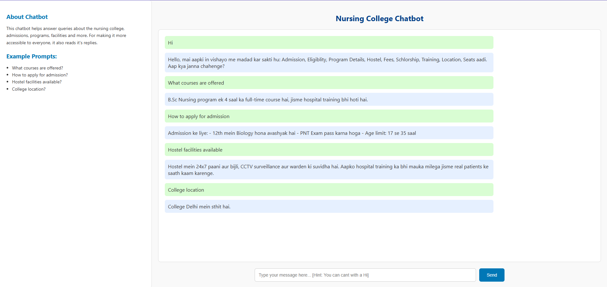
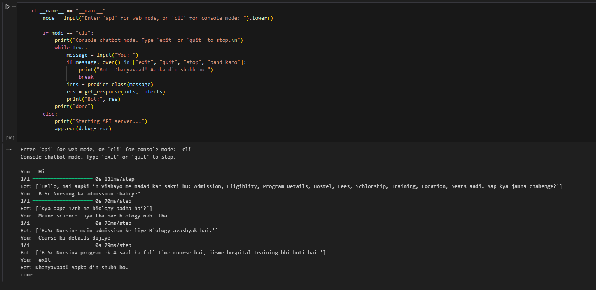

# 🩺 Medical Chatbot for Nursing College

A lightweight, bilingual (Hindi-English) conversational chatbot built using **Python**, **TensorFlow (Keras)**, **NLTK**, and **Flask**.  
It helps answer medical and college-related queries in a friendly, voice-enabled web interface.

---

## 📌 Features

- Intent classification using a trained neural network.
- Clean web interface built with **HTML/CSS/JavaScript**.
- Voice output via **Web Speech API**.
- Smart response handling for:
  - Positive replies (e.g. `Haan`, `Yes`, `Batao`)
  - Negative replies (e.g. `Nahi`, `No`)  
- Option to run the chatbot in both:
  - **API (web)** mode via browser
  - **CLI (console)** mode via terminal

---

## 📂 Project Structure

```
Medical_Chat_Bot/
├── chatbot_model.h5             # Trained TensorFlow model
├── intents.json                 # Intent data file
├── Chat_Bot.py                  # Main Flask backend application
├── chatbot_training.ipynb       # Model training notebook
├── templates/
│   └── index.html               # Frontend web page
├── static/
│   └── style.css                # (optional external CSS)
├── environment.yml              # Conda environment file
├── README.md                    # Project documentation
```

---

## 📦 Setup Instructions

### 1️⃣ Clone the repository
```bash
git clone https://github.com/your-username/Medical_Chat_Bot.git
cd Medical_Chat_Bot
```

### 2️⃣ Set up Conda environment
```bash
conda env create -f environment.yml
conda activate chatbot_env
```

### 3️⃣ (Optional) Install IPython kernel for Jupyter use
```bash
python -m ipykernel install --user --name chatbot_env --display-name "Python (chatbot_env)"
```

### 4️⃣ Train the Model (if needed)
Run `chatbot_training.ipynb` notebook to retrain and save a new `chatbot_model.h5` compatible with your TensorFlow version.

### 5️⃣ Run the Chatbot
```bash
python Chat_Bot.py
```
Choose between:
- `api` → Web mode (access via `http://127.0.0.1:5000`)
- `cli` → Terminal chat mode

---

## 🗣️ Response Handling Logic

- **Positive Responses** (`Haan`, `Yes`, `Tell me more`, `Kya hai?`, `Batao`)  
  → Bot continues conversation.

- **Negative Responses** (`Nahi`, `No`)  
  → Bot ends politely and offers future help.

- **Other inputs**  
  → Processed via trained intent model.

---

## 🎨 Frontend Design Highlights

- Clean, color-coordinated web interface.
- Chat window with message bubbles.
- Example prompts sidebar.
- Speech synthesis for bot replies.
- Responsive input box with hover effects.

---

## 📌 Dependencies

- Python 3.11+
- TensorFlow 2.13+
- Flask
- NLTK
- NumPy
- h5py

(See `environment.yml` for full list.)

---


## 📸 Screenshot: Chatbot Web Interface



## 📸 Example Response




---

## 📖 License

This project is for educational and personal development use.

---

## 🙌 Acknowledgements

Built by **Pragya Vijay** for a Nursing College chatbot project.
